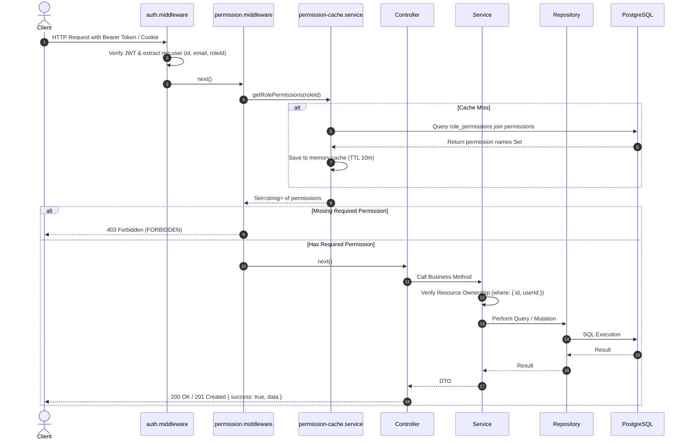

# Dynamic RBAC Architecture & Design Specification

**Document**: `docs/security/dynamic-rbac-design.md`  
**Version**: 1.0.0  
**Target**: `template-be`

---

## 1. Architectural Concept

Dynamic Role-Based Access Control (RBAC) decouples permission enforcement from role identifiers.

```text
User ──(1:1)──> Role ──(1:N)──> RolePermission ──(N:1)──> Permission
```

1. **Permission**: An atomic authorization capability named using the standard `RESOURCE_ACTION` format (e.g. `USER_CREATE`, `WALLET_READ`, `ROLE_PERMISSION_ASSIGN`).
2. **Role**: A named collection of permissions (e.g. `ADMIN`, `MANAGER`, `USER`, `ACCOUNTANT`, `AUDITOR`). Roles can be dynamically created, updated, and deleted through administrative APIs.
3. **User**: Assigned a single role (`roleId`) which grants the full set of effective permissions mapped to that role.
4. **Middleware Enforcement**: Route guards use `requirePermission('RESOURCE_ACTION')` rather than checking hardcoded role names.
5. **Ownership Enforcement**: The Service layer verifies resource ownership (`userId`) in parallel to capability authorization, mitigating IDOR risks.

---

## 2. Dynamic RBAC Data Flow



---

## 3. Standard Permission Catalog

| Resource | Action | Permission Name | Description |
| :--- | :--- | :--- | :--- |
| `USER` | `READ` | `USER_READ` | View user list and profile details |
| `USER` | `CREATE` | `USER_CREATE` | Create new user accounts |
| `USER` | `UPDATE` | `USER_UPDATE` | Update user status and roles |
| `USER` | `DELETE` | `USER_DELETE` | Soft delete user accounts |
| `USER` | `ASSIGN_ROLE` | `USER_ROLE_ASSIGN` | Assign role to users |
| `ROLE` | `READ` | `ROLE_READ` | View roles and role permissions |
| `ROLE` | `CREATE` | `ROLE_CREATE` | Create new custom roles |
| `ROLE` | `UPDATE` | `ROLE_UPDATE` | Edit role information |
| `ROLE` | `DELETE` | `ROLE_DELETE` | Delete non-system roles |
| `PERMISSION` | `READ` | `PERMISSION_READ` | View system permission catalog |
| `ROLE_PERMISSION` | `ASSIGN` | `ROLE_PERMISSION_ASSIGN` | Assign/revoke permissions to/from roles |
| `NOTIFICATION` | `READ` | `NOTIFICATION_READ` | View system notifications and logs |
| `NOTIFICATION` | `CREATE` | `NOTIFICATION_CREATE` | Send notifications to users |
| `NOTIFICATION` | `UPDATE` | `NOTIFICATION_UPDATE` | Retry failed email deliveries |
| `NOTIFICATION` | `DELETE` | `NOTIFICATION_DELETE` | Delete notification logs |
| `NOTIFICATION_TEMPLATE` | `READ` | `NOTIFICATION_TEMPLATE_READ` | View email/notification templates |
| `NOTIFICATION_TEMPLATE` | `MANAGE` | `NOTIFICATION_TEMPLATE_MANAGE` | Create and edit notification templates |
| `AUDIT_LOG` | `READ` | `AUDIT_LOG_READ` | View security and RBAC audit logs |
| `MAINTENANCE` | `READ` | `MAINTENANCE_READ` | View maintenance state and config |
| `MAINTENANCE` | `MANAGE` | `MAINTENANCE_MANAGE` | Configure maintenance windows and IPs |
| `MAINTENANCE` | `BYPASS` | `MAINTENANCE_BYPASS` | Access system during maintenance mode |
| `API_KEY` | `READ` | `API_KEY_READ` | View API keys and usages |
| `API_KEY` | `MANAGE` | `API_KEY_MANAGE` | Create and revoke API keys |
| `WEBHOOK` | `READ` | `WEBHOOK_READ` | View webhook configurations and logs |
| `WEBHOOK` | `MANAGE` | `WEBHOOK_MANAGE` | Create, test, and manage webhooks |
| `SYSTEM_CONFIG` | `READ` | `SYSTEM_CONFIG_READ` | View system configuration flags |
| `SYSTEM_CONFIG` | `MANAGE` | `SYSTEM_CONFIG_MANAGE` | Modify system configurations |
| `CRON_JOB` | `READ` | `CRON_JOB_READ` | View cron execution history |
| `CRON_JOB` | `MANAGE` | `CRON_JOB_MANAGE` | Trigger and configure scheduled jobs |
| `KEYBOARD` | `READ` | `KEYBOARD_READ` | View keyboard themes catalog |
| `KEYBOARD` | `CREATE` | `KEYBOARD_CREATE` | Create new keyboard theme |
| `KEYBOARD` | `UPDATE` | `KEYBOARD_UPDATE` | Update keyboard theme metadata |
| `KEYBOARD` | `DELETE` | `KEYBOARD_DELETE` | Delete or archive keyboard theme |
| `CATEGORY` | `READ` | `CATEGORY_READ` | View theme categories |
| `CATEGORY` | `CREATE` | `CATEGORY_CREATE` | Create new theme category |
| `CATEGORY` | `UPDATE` | `CATEGORY_UPDATE` | Edit theme category |
| `CATEGORY` | `DELETE` | `CATEGORY_DELETE` | Delete theme category |
| `COLLECTION` | `READ` | `COLLECTION_READ` | View curated collections |
| `COLLECTION` | `CREATE` | `COLLECTION_CREATE` | Create theme collection |
| `COLLECTION` | `UPDATE` | `COLLECTION_UPDATE` | Update theme collection |
| `COLLECTION` | `DELETE` | `COLLECTION_DELETE` | Delete theme collection |
| `STUDIO` | `ACCESS` | `STUDIO_ACCESS` | Access Creator Studio workspace |
| `CREATOR` | `MANAGE` | `CREATOR_MANAGE` | Review and manage creator applications |

---

## 4. System Protection Invariants

1. **System Roles Invariant**:
   - `Role.isSystem`: Roles created by the system (`ADMIN`, `MANAGER`, `USER`) have `isSystem = true` and cannot be deleted or renamed.
2. **Administrator Anti-Lockout Invariant**:
   - The `ADMIN` role cannot have the `ROLE_PERMISSION_ASSIGN` permission revoked.
   - An administrator cannot soft-delete themselves or remove their own administrative role if they are the sole administrator.
3. **Cache Invalidation Invariant**:
   - Whenever permissions for a role are mutated, `permissionCache.invalidateRole(roleId)` must be invoked immediately to guarantee fresh authorization states across subsequent requests.
